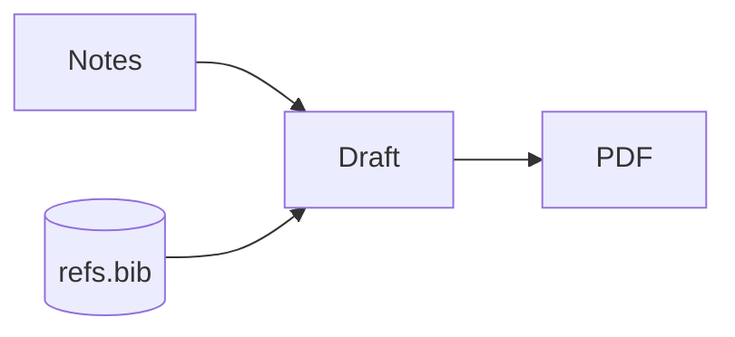

## Math

Inline math (`$...$`) and display math (`$$...$$` alone on its lines) render
inside the note. Display math is centered as a block; inline math sits in the
line of text. Put the cursor on a formula and its LaTeX source reappears for
editing, like every other live-preview construct.

```md
The estimator is $\hat{\beta} = (X^\top X)^{-1} X^\top y$, and its variance is

$$
\operatorname{Var}(\hat{\beta}) = \sigma^2 (X^\top X)^{-1}
$$
```

Rendering goes through [RaTeX](https://github.com/erweixin/RaTeX), a
KaTeX-compatible math engine written in Rust, so the syntax you already know
from KaTeX applies. Nothing is fetched at render time and no browser is
involved.

## Mermaid diagrams

A fenced `mermaid` block renders as a diagram, themed to match your editor
theme:

````md

````

That block draws as:

<Mermaid
  chart={`flowchart LR
  notes[Notes] --> draft[Draft]
  draft --> pdf[PDF]
  refs[(refs.bib)] --> draft`}
/>

Nodes get accent colors even when the source specifies none. As with math,
moving the cursor into the block reveals the source.

<Callout title="Both are plain text on disk">
Math and diagrams are ordinary markdown — `$$` and a fenced code block.
GitHub, Obsidian, and Pandoc all read the same file; Suzuri just draws it.
</Callout>
